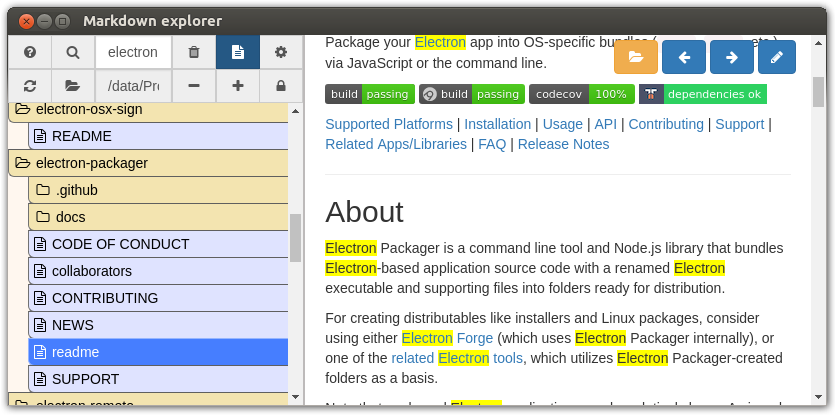
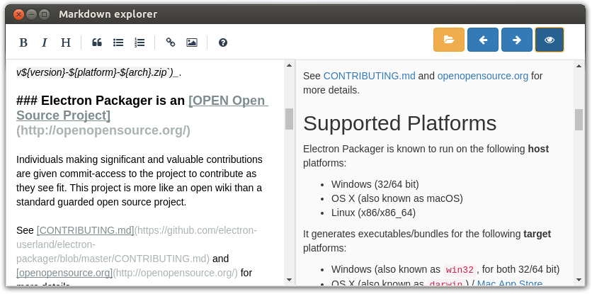

# Markdown Explorer 
*Easily explore, view and edit markdown documentation of a file tree.*

## Common use case

If your projects documentation is written in Markdown, with md files dispersed throughout your project tree, Mardown Explorer displays md files in a tree structure, and it allows filtering by file name or by file content.

## Quick start

Just drop a folder on the window (or clic on the folder icon on top left) to show the Markdow documentation of this folder. Then, explore the tree on the left, and toggle view/edit mode on md file with the button on the top right.

## Features

* md file Tree
    * Show only md file in a file tree
    * Filter
        * Filter file tree by file content
        * Filter file tree by file name
        * Filter file tree by file path
        * Highlight occurrences
    * Ignore some folder names
    * Tree and file content cache to speed up search/tree display
    * Remove number and underscore from file/folder names in tree view
* md files
    * View md file
    * Add generated table of content automatically at begin of render view
    * Edit md file
    * Automatic save
    * Quick md syntax help
* Navigate : 
  * previous/next opened md with scroll position
  * relative reference md links
* Remember last opened tree/file
* Pass configiguration from command line : set tree/md path to show, and folders to ignore in tree

## Screenshots

### Md tree and view mode :


### Edit mode :


## How To Use
```
$ git clone https://github.com/jersou/markdown-explorer
$ cd markdown-explorer
$ npm install
$ npm start
```

**or [ download the app](https://github.com/jersou/markdown-explorer/releases)**


## Documentation
The app documentation is avaible inside the [doc folder](doc/)

## Stack

* [Electron](https://github.com/electron) : to build the cross platform desktop app
* [SimpleMDE](https://github.com/sparksuite/simplemde-markdown-editor) : to edit md files
* [ShowdownJS](https://github.com/showdownjs/showdown) : to render md files
* [showdown-toc](https://github.com/ravisorg/showdown-toc) : to generate table of content
* [Github Markdown CSS](https://github.com/sindresorhus/github-markdown-css) : to replicate the GitHub Markdown style
* and more : [Development/Dependencies.md](doc/Development/Dependencies.md).


##  Note
This app is my first Electron app (except very small tests), then it's probably not a good example ;-), it's a quick dev to learn Electron and it would be necessary to refactor the code in the (near) future (but it's functional :-) ).

## Contributor
Jeremy Soulary


# License

MIT License

Copyright (c) 2018 Jeremy Soulary http://www.soulary.com/

Permission is hereby granted, free of charge, to any person obtaining a copy of this software and associated documentation files (the "Software"), to deal in the Software without restriction, including without limitation the rights to use, copy, modify, merge, publish, distribute, sublicense, and/or sell copies of the Software, and to permit persons to whom the Software is furnished to do so, subject to the following conditions:

The above copyright notice and this permission notice shall be included in all copies or substantial portions of the Software.

THE SOFTWARE IS PROVIDED "AS IS", WITHOUT WARRANTY OF ANY KIND, EXPRESS OR IMPLIED, INCLUDING BUT NOT LIMITED TO THE WARRANTIES OF MERCHANTABILITY, FITNESS FOR A PARTICULAR PURPOSE AND NONINFRINGEMENT. IN NO EVENT SHALL THE AUTHORS OR COPYRIGHT HOLDERS BE LIABLE FOR ANY CLAIM, DAMAGES OR OTHER LIABILITY, WHETHER IN AN ACTION OF CONTRACT, TORT OR OTHERWISE, ARISING FROM, OUT OF OR IN CONNECTION WITH THE SOFTWARE OR THE USE OR OTHER DEALINGS IN THE SOFTWARE.

